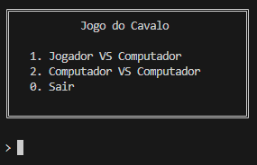

# Manual Utilizador

## Jogo do Cavalo

---

### Índice

- [Introdução](#introducao)
- [Descrição Base do Jogo](#descricao)
- [Objetivos do programa](#objetivos)
- [Instalação e Preparação](#instalacao)
- [Inicialização](#inicializacao)
- [Ecrãs de interface](#ecras)
- [Exportar Resultados](#exportar)

### Introdução

---

Este documento tem como finalidade fornecer ao utilizador as capacidades e informações necessárias para uma rápida aprendizagem e fácil utilização do programa, deste modo será falado do objetivo do mesmo e de como utilizar o programa de forma eficiente e eficaz.

### Descrição Base do Jogo

---

O jogo do cavalo é uma variação do problema conhecido como o Passeio do Cavalo, onde num tabuleiro semelhante ao do xadrez mas com dimensões de 10 por 10 tem-se como objetivo percorrer todas as casas sem repetição usando a movimentação especifica do cavalo. Esta é a perspetiva geral do jogo, na secção seguinte será aprofundado qual o objetivo no contexto de desenvolvimento do projeto de Inteligência Artificial.

### Objetivos do Programa

---

A aplicação é uma versão modificada do jogo do cavalo com 2 jogadores o "Jogador 1" (cavalo branco) e o "Jogador 2" (cavalo preto) onde o Jogador 1 joga sempre primeiro seguido pelo jogador 2. O jogo conta com dois modos de jogo, estes sendo "Jogador vs Computador" e "Computador vs Computador". O objetivo do jogo em si é acumular mais pontos que o adversário num tabuleiro onde todas as casas têm um valor aleatório entre 00 e 99 sem repetição.

O jogo começa com o posicionamento do cavalo do “Jogador 1” (cavalo branco) na casa com maior pontuação da primeira linha (A1-J1) e com a devida sucessão do “Jogador 2” (cavalo preto) na decima linha (A10-J10), o jogo desenrola-se por turnos sucessivos onde o “Jogador 1” faz a sua jogada e o “Jogador 2” responde. O jogo acaba quando nenhum do jogadores tiver jogadas possíveis.
    

Algumas regras pertinentes:

- Jogo de 2 jogadores.
- O tabuleiro é gerado aleatoriamente cada vez que um jogo é iniciado.
- Se a jogada acabar num número com dois dígitos diferentes então o seu simétrico fica bloqueado. Exemplo: jogada para 23 então o 32 fica bloqueado.
- Se a jogada acabar num número com dois dígitos iguais então o jogador pode escolher outro número da mesma natureza a ser eliminado. Exemplo: jogada para 22 e jogador elimina o 33.
- Uma casa já visitada por qualquer dos jogadores fica também bloqueada.
- Um cavalo não pode saltar para uma casa bloqueada ou ameaçada pelo adversário.
- A pontuação é obtida pela casa visitada, não pelos simétricos bloqueados.
- Caso um jogador não tenha jogadas possíveis, a sua vez é passada.
- O jogador que tiver mais pontos no fim do jogo é o vencedor.

### Instalação e Preparação

---

Para efetuar a correta execução do programa, o utilizador deve possuir o ficheiro do projeto e todos os componentes relacionados onde está o código. 

### Inicialização

---

Após a abertura e de por o projeto em funcionamento o mesmo executa a função *start* automaticamente o que dará inicio a todo o processo do programa e onde será apresentada uma interface de menu inicial.

### Ecrãs de interface

---

> Todos os ecrãs de interface do programa têm como propósito serem simples e diretos. Estes consistem no pedido de *inputs* básicos ao utilizador, geralmente com números de 0 a 9, onde o utilizador introduz a sua escolha e carrega *Enter*. No caso de ser introduzido um valor inválido ou fora das opções disponíveis o menu será apresentado novamente pedindo um novo *input* válido.
> 

1. Menu Inicial
    
    
    
    Este é o menu que aparece assim que o programa é inicializado onde é pedido ao utilizador para escolher o modo de jogo. São apresentas três opções ao utilizador, a opção “1” para o modo de jogo de jogador contra computador, a opção “2” para computador contra computador e a opção “0” para terminar a execução do programa.
    
2. Escolher o “Jogador 1”
    
    
    
    Esta interface pede ao utilizador para escolher quem joga primeiro. O utilizador dispões de três opções onde a opção “1” para a primeira jogada ser do jogador, a opção “2” para a primeira jogada ser do computador e a opção “3” para voltar ao menu inicial.
    
3. Escolher o tempo de Jogada 
    
    
    
    Esta Interface pede ao utilizador para definir o tempo limite para a jogada do computador. O utilizador deverá introduzir um número entre 1000 e 5000 que representa milissegundos. O utilizador pode também introduzir “0” para voltar ao menu inicial.
    
4. Escolher a Primeira Jogada 
    
    
    
    Esta é a interface é apresentada quando o jogo é iniciado, é possível visualizar os dois cavalos colocados na casa de maior valor. É pedido em baixo para o utilizador introduzir as coordenadas para a próxima jogada, primeiro a linha e depois a coluna.
    
5. Jogada Inválida 
    
    
    
    Se o utilizador introduzir coordenadas inválidas o utilizador é notificado com uma mensagem de erro e é lhe pedido para reintroduzir coordenadas.
    
6. Número Duplo
    
    
    
    Esta Interface aparece quando a regra do número duplo é acionada, é pedido ao utilizador para introduzir um outro número duplo a ser removido, caso a introdução seja inválida é apresentado uma mensagem de erro e é feito o pedido para reintroduzir.
   
7. Fim do Jogo
    
    
    
    Esta é a Interface apresentada quando o jogo chega ao fim, mostrado o vencedor do jogo e os pontos de cada jogador. É também possível começar outro jogo ao introduzir “0” na consola.

 

### Exportar Resultados

---

Durante a execução do programa será guardado num ficheiro log.dat e mostrados no ecrã alguns dados sendo os mesmos pertinentes para o entendimento do processo do algoritmo. Este processo ocorre a cada jogada feita pelo o computador logo o ficheiro é atualizado no fim de cada jogada.

Os dados a serem exportados são:

- Número de nós analisados- Número de nós analisados pelo algoritmo para chegar a jogada feita.
- Valor de avaliação- Valor de avaliação do nó mostrado.
- Cortes Alfa- Número de Cortes Alfa feitos durante a execução do algoritmo.
- Cortes Beta- Número de Cortes Beta feitos durante a execução do algoritmo.
- Tempo Gasto- Tempo gasto a executar a jogada
- Tabuleiro- Tabuleiro atualizado com a jogada do computador