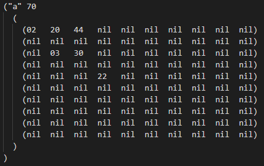

# Manual Utilizador

## Jogo do Cavalo

---

### Índice

- [Introdução](#introducao)
- [Descrição Base do Jogo](#descricao)
- [Objetivos do Programa](#objetivos)
- [Instalação e Preparação](#instalacao)
- [Inicialização](#inicializacao)
- [Ecrãs de interface](#interface)
    1. [Menu Inicial](#inicial)
    2. [Escolher o Problema](#problema)
    3. [Escolher Algoritmo](#algoritmo)
    4. [Introdução de Profundidade (DFS)](#profundidade)
    5. [Escolha da Heurística (A*)](#heuristica)
- [Resultados Finais](#resultados)
- [Exportar Resultados](#exportar)

---

### Introdução

Este documento tem como finalidade fornecer ao utilizador as capacidades e informações necessárias para uma rápida aprendizagem e fácil utilização do programa, deste modo será falado do objetivo do mesmo e de como utilizar o programa de forma eficiente e eficaz.

---

### Descrição Base do Jogo

O jogo do cavalo é uma variação do problema conhecido como o Passeio do Cavalo, onde num tabuleiro semelhante ao do xadrez mas com dimensões de 10 por 10 tem-se como objetivo percorrer todas as casas sem repetição usando a movimentação especifica do cavalo de modo a chegar a uma pontuação alvo.

---

### Objetivos do Programa

A aplicação é uma versão simplificada onde o objetivo é ler um determinado problema de um ficheiro denominado de “problemas.dat” onde o tabuleiro vem com uma formatação predefinida em que as casas têm uma pontuação ou estão bloqueadas e o cavalo tem uma pontuação objetivo. O utilizador escolherá o ponto de partida das casas disponíveis na primeira linha e o cavalo tem de automaticamente achar o caminho solução para chegar á pontuação definida.

Algumas regras pertinentes:

- Existe apenas um jogador.
- Se a jogada acabar num número com dois dígitos diferentes então o seu simétrico fica bloqueado. Exemplo: jogada para 23 então o 32 fica bloqueado.
- Se a jogada acabar num número com dois dígitos iguais então o jogador pode escolher outro número da mesma natureza a ser eliminado. Exemplo: jogada para 22 e jogador elimina o 33.
- Um cavalo não pode saltar para uma casa bloqueada.
- O jogo acaba quando a pontuação for maior ou igual á pontuação objetivo.

---

### Instalação e Preparação

Para efetuar a execução do programa deve dispor do ficheiro e de todos os seus componentes contendo o código. Além dos ficheiros principais deve conter o ficheiro “problemas.dat” devidamente organizado de modo a ser interpretado pelo programa.

O utilizador pode desta maneira criar novos problemas com a pequena restrição de ter de seguir a formatação acima apresentada onde:

- “a” é o identificador do problema
- “70” - é a pontuação objetivo
- Matriz - é uma representação gráfica do tabuleiro de xadrez

---

### Inicialização

Após a abertura e de por o projeto em funcionamento o mesmo executa a função *start* automaticamente o que dará inicio a todo o processo do programa e onde será apresentada uma interface de menu inicial.

---

### Ecrãs de interface

> Todos os ecrãs de interface do programa têm como propósito serem simples e diretos. Estes consistem no pedido de *inputs* básicos ao utilizador, geralmente com números de 0 a 9, onde o utilizador introduz a sua escolha e carrega *Enter*. No caso de ser introduzido um valor inválido ou fora das opções disponíveis o menu será apresentado novamente pedindo um novo *input* válido.
> 

1. Menu Inicial
    
    
    
    Este é o menu que aparece assim que o programa é inicializado onde são apresentas duas opções ao utilizador. A opção “1” para prosseguir e escolher o problema a ser resolvido e a opção “0” para terminar a execução do programa.

2. Escolher o Problema
    
    
    
    
    
    
    Esta interface pede ao utilizador para introduzir qual o problema a resolver, esta escolha deve ser feita com recurso ao número atribuído a cada problema. A identificação numérica está diretamente relacionada com a alfabética (a→1, b→2, etc…). Pode ser também introduzido o número “0” para voltar ao menu anterior.
    

3. Escolher Algoritmo 
    
    > Cada um destes algoritmos tem diferentes formas de funcionamento e aspetos determinantes o que leva a uma diferença de tempo e desempenho entre eles.
    > 
    
    
    
    Este menu pede ao utilizador para escolher qual o algoritmo a usar para resolver o problema anteriormente selecionado. Os algoritmos são o DFS (*Depth First Search*), BFS (*Breath First Search*) e o A* (*A Star*). O utilizador pode também voltar a selecionar o problema ao selecionar o “0”.
    

1. Introdução de Profundidade (DFS)
    
    
    
    Esta interface serve para o utilizador introduzir a profundidade máxima a ser explorada no caso de o utilizador ter escolhido o algoritmo DFS no menu anterior. O utilizador pode voltar ao menu anterior se escolher a opção “0”.

2. Escolha de Heurística (A*)
    
    
    
    Este menu serve para o caso de o utilizador escolher o algoritmo A* ser possível optar pela heurística base ou por uma heurística personalizada. É também possível voltar ao menu anterior  pela introdução de um “0”.
    
    > A escolha da heurística é importante pois impacta a eficiência e eficácia do algoritmo A*.
    > 
    > - Heurística Base → $$ h(x) = {{O(x) \over M(x)}} $$ onde $O(x)$ é o número de pontos que falta parta atingir a pontuação alvo e onde o $M(x)$ é a média de pontos por casa.
    > - Heurística Personalizada → $$ h(x) = {{S(x) * A(x)}\over {S{max}*A{max}}} $$ onde $S(x)$ é a pontuação da casa, $A(x)$ é o numero de jogadas possíveis, $S{max}(x)$ é a maior pontuação no tabuleiro e $A{max}(x)$

---

### Resultados Finais

> Os resultados do problema serão apresentados em forma de print com o propósito de tornar os dados em informação de fácil entendimento, onde as informações apresentadas seguem a regra de “Título: Informação”.
> 

Esta é a interface apresentada para os resultados finais do problema onde são apresentadas diversas informações como:

- Problema → Indica qual o problema a ser resolvido
- Algoritmo → Apresenta o acrónimo do algoritmo escolhido
- Duração → Representa o tempo que o programa demora a chegar á solução
- Número de nós gerados → Somatório de todos os nós gerados pelo programa
- Número de nós expandidos → Número de nós fechados durante a execução do algoritmo
- Penetrância → Valor de medida para avaliação de qualidade da solução
- Fator de ramificação média → Média de nós filhos por nó pai.
- Comprimento da solução → Profundidade máxima da solução encontrada
- Caminho Solução → Lista de casas que representam o caminho do cavalo
- Tabuleiro final → Estado do tabuleiro no final do algoritmo representado graficamente

---

### Exportar Resultados

Após os dados que resultam da solução serem apresentados ao utilizador durante a execução do programa, estes são também exportados para um ficheiro **resultados.dat** com o intuito de ser possível consultar a solução obtida mesmo depois da aplicação ser fechada. Este ficheiro será gerado automaticamente depois de uma solução ser encontrada e será atualizado caso o utilizador realiza mais problemas. Este ficheiro terá uma formatação semelhante á apresentada nos Resultados Finais.

---